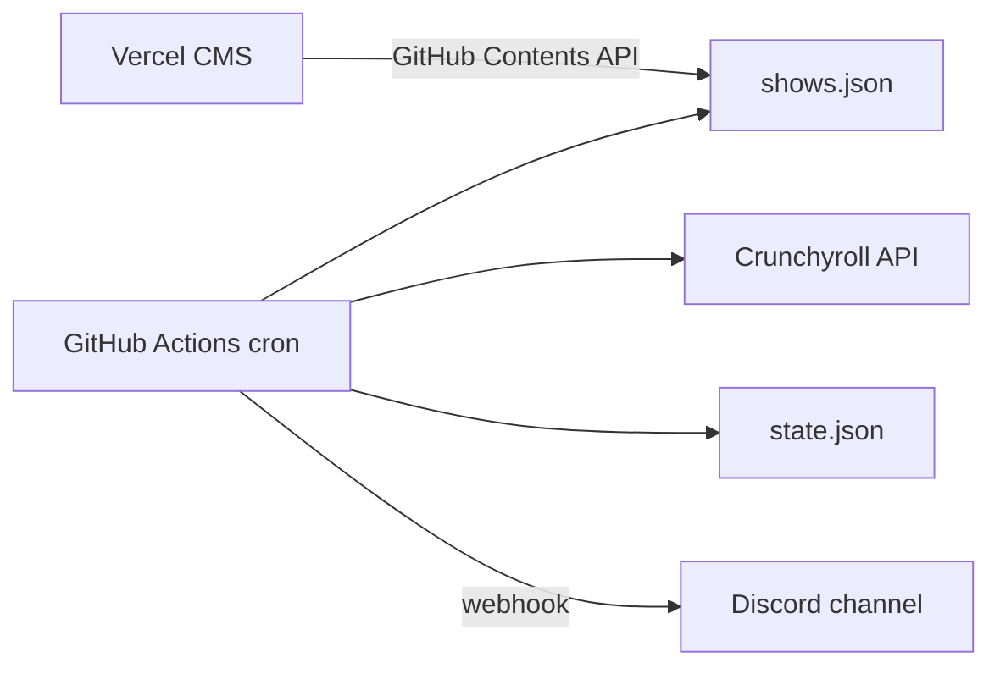

# Anime Episode Checker

Checks Crunchyroll for newly available episodes and sends Discord alerts when an episode actually drops. Manage tracked shows through a small admin CMS on Vercel.

## How it works



1. **GitHub Actions** runs every 30 minutes and calls `node src/check.js`
2. The checker reads [`shows.json`](shows.json) and queries Crunchyroll’s API for the latest available episode per show
3. On first run for a show, it **baselines** the current episode (no alert)
4. When a newer episode becomes available, it posts to **Discord** and updates [`state.json`](state.json)
5. The **Vercel admin** edits `shows.json` in your repo (add/remove shows, set expected drop times)

## Tracked shows

Seeded in [`shows.json`](shows.json):

- One Piece
- That Time I Got Reincarnated as a Slime

Set `expectedDropAt` in the CMS when you know the next scheduled drop. Discord alerts include whether the episode was early, on time, or late.

## Setup

### 1. Discord webhook

1. Discord server → **Server Settings** → **Integrations** → **Webhooks**
2. Create a webhook for your notification channel
3. Copy the webhook URL

### 2. GitHub Actions secret

In your repo: **Settings** → **Secrets and variables** → **Actions** → **New repository secret**

| Secret | Value |
|--------|-------|
| `DISCORD_WEBHOOK_URL` | Your Discord webhook URL |

The workflow uses the default `GITHUB_TOKEN` to commit `state.json` updates.

### 3. Vercel admin CMS

1. Import this repo in [Vercel](https://vercel.com)
2. Set **Root Directory** to `admin`
3. Add environment variables (see [`admin/.env.example`](admin/.env.example)):

| Variable | Description |
|----------|-------------|
| `ADMIN_PASSWORD` | Password for the admin UI |
| `GITHUB_TOKEN` | PAT with `contents: write` on this repo |
| `GITHUB_REPO` | `your-username/anime-ep-checker` |
| `GITHUB_BRANCH` | `main` (optional) |

4. Deploy — you’ll get a URL like `anime-ep-checker.vercel.app`

### 4. Manual check (optional)

```bash
# Baseline / check without writing state
node src/check.js --dry-run

# Run locally (requires DISCORD_WEBHOOK_URL in .env or env)
npm run check
```

## CMS usage

1. Open your Vercel admin URL and sign in
2. **Add show** — paste a Crunchyroll series URL (e.g. `https://www.crunchyroll.com/series/GRMG8ZQZR/one-piece`)
3. Set **Expected next drop** — when the episode is supposed to release
4. **Save changes** — commits to `shows.json` on GitHub
5. After an episode drops, bump the expected drop time for the next week

## Files

| File | Purpose |
|------|---------|
| [`shows.json`](shows.json) | Tracked series + expected drop times |
| [`state.json`](state.json) | Last notified episode per show |
| [`src/check.js`](src/check.js) | Main checker CLI |
| [`src/crunchyroll.js`](src/crunchyroll.js) | Crunchyroll API client |
| [`src/discord.js`](src/discord.js) | Discord webhook alerts |
| [`admin/`](admin/) | Vercel CMS |
| [`.github/workflows/check-episodes.yml`](.github/workflows/check-episodes.yml) | Scheduled checker |

## Notes

- Uses Crunchyroll’s undocumented internal API (anonymous token). It may break if they change endpoints.
- Episode availability is based on `premium_available_date` (premium simulcast timing).
- The checker excludes OVA/extras/dub seasons when picking the latest season.
