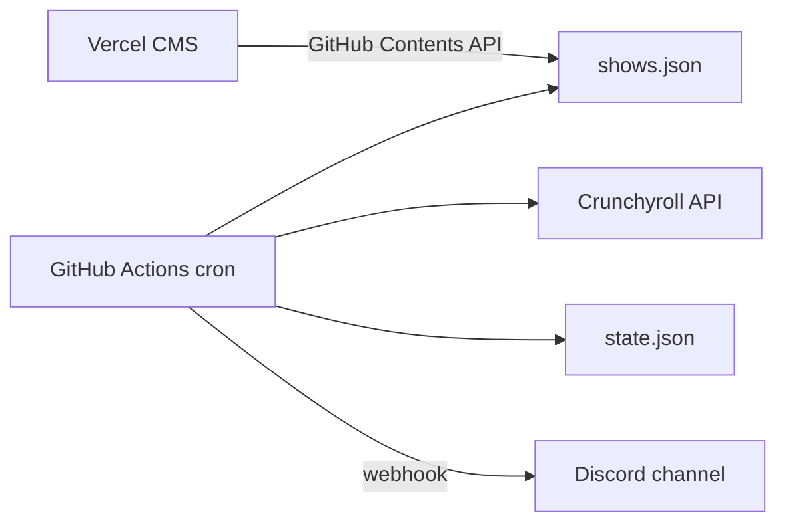

# Anime Episode Checker

Checks Crunchyroll for newly available episodes and sends Discord alerts when an episode actually drops. Manage tracked shows through a small admin CMS on Vercel.

## How it works



1. **GitHub Actions** runs a **5-minute** cron. A cheap gate skips install and Crunchyroll unless a show is in its **drop window** (10 minutes before expected time through until the episode is found).
2. Inside the window, the checker runs about every **5 minutes** and calls `pnpm check`.
3. On first run for a show (inside a window), it **baselines** the current episode (no alert)
4. When the expected episode becomes available, it posts to **Discord** and updates [`state.json`](state.json)
5. If an episode is **late** (15+ min past expected), it sends a one-time **still waiting** Discord message
6. The **Vercel admin** edits `shows.json` in your repo

## Schedule model

Each show uses a weekly schedule instead of a single drop datetime:

| Field | Meaning |
|-------|---------|
| `mode` | `finite` (season with end) or `ongoing` (no end, e.g. One Piece) |
| `startAt` | When the anchor episode(s) should drop (**Eastern Time / ET**) |
| `startEpisode` | Episode number that `startAt` refers to |
| `episodeCount` | Total episodes (finite only) |
| `premiereBatchSize` | Episodes that drop on day 1 (default `1`) |

After the premiere batch, each following episode is expected **7 days** later.

## Setup

### 1. Discord webhook

1. Discord server → **Server Settings** → **Integrations** → **Webhooks**
2. Create a webhook for your notification channel
3. Copy the webhook URL

### 2. GitHub Actions secret

| Secret | Value |
|--------|-------|
| `DISCORD_WEBHOOK_URL` | Your Discord webhook URL |

The workflow uses the default `GITHUB_TOKEN` to commit `state.json` updates.

### 3. Vercel admin CMS

1. Import this repo in [Vercel](https://vercel.com)
2. Set **Root Directory** to `admin`
3. Set package manager to **pnpm** (auto-detected from `admin/pnpm-lock.yaml`)
4. Add environment variables (see [`admin/.env.example`](admin/.env.example)):

| Variable | Description |
|----------|-------------|
| `ADMIN_PASSWORD` | Password for the admin UI |
| `GITHUB_TOKEN` | PAT with `contents: write` on this repo |
| `GITHUB_REPO` | `your-username/anime-ep-checker` |
| `GITHUB_BRANCH` | `main` (optional) |

### 4. Local development

```bash
# Root checker (Node 24.11.1)
pnpm install
node --experimental-strip-types src/should-run.ts   # gate only
pnpm check -- --dry-run
pnpm check -- --force        # bypass drop windows (debug)

# Admin CMS
cd admin
pnpm install
pnpm dev
```

Requires `DISCORD_WEBHOOK_URL` in `.env` for live Discord alerts.

## CMS usage

1. Open your Vercel admin URL and sign in
2. Add a Crunchyroll series URL
3. Choose **Finite season** or **Ongoing**
4. Set start date/time (**Eastern Time**), start episode number, and premiere batch size
5. **Save changes** — commits to `shows.json` on GitHub

## Files

| File | Purpose |
|------|---------|
| [`shows.json`](shows.json) | Tracked series + weekly schedules |
| [`state.json`](state.json) | Last notified episode per show |
| [`src/check.ts`](src/check.ts) | Main checker CLI |
| [`src/schedule.ts`](src/schedule.ts) | Expected drop times + check windows |
| [`src/crunchyroll.ts`](src/crunchyroll.ts) | Crunchyroll API client |
| [`src/discord.ts`](src/discord.ts) | Discord webhook alerts |
| [`src/should-run.ts`](src/should-run.ts) | Cheap gate for Actions (skip install when idle) |
| [`admin/`](admin/) | Vercel CMS (Next.js + TypeScript) |
| [`.github/workflows/check-episodes.yml`](.github/workflows/check-episodes.yml) | Scheduled checker |

## Notes

- Uses Crunchyroll’s undocumented internal API (anonymous token). It may break if they change endpoints.
- Episode availability is based on `premium_available_date` (premium simulcast timing).
- The checker excludes OVA/extras/dub seasons when picking the latest season.
- Schedule times are stored in UTC but entered and displayed as **Eastern Time (EST/EDT)** in the CMS and Discord alerts.
- Overdue episodes keep getting checked every 5 minutes (inside the active window) until Crunchyroll has them.
- Most workflow runs exit after the gate when no show has entered its drop window yet.
- Requires **Node 24.11.1** (local and GitHub Actions).
