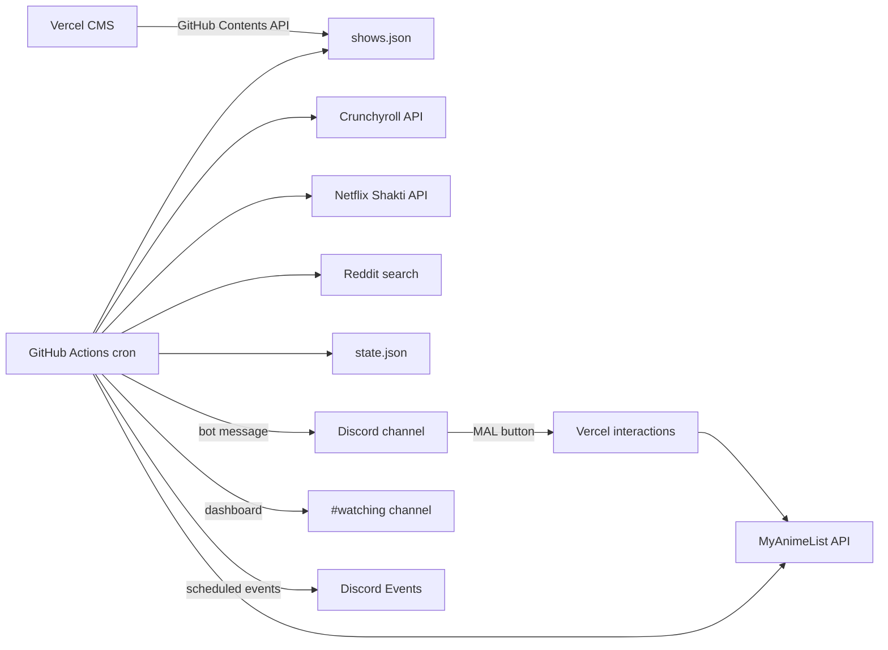

# Anime Episode Checker

Checks **Crunchyroll** or **Netflix** for newly available anime episodes and sends Discord alerts when an episode drops. Manage tracked shows through a small admin CMS on Vercel.

## How it works



1. **GitHub Actions** is triggered every **5 minutes** by an external cron (see [Reliable polling](#reliable-polling) below). A cheap gate skips install and provider checks unless a show is in its **drop window** (at expected drop time through 90 minutes after; then about every 30 minutes if still missing).
2. Inside the window, the checker runs about every **5 minutes** and calls `pnpm check`.
3. Each show uses **Crunchyroll or Netflix** (not both).
4. On first run for a show (inside a window), it **baselines** the current episode (no alert).
5. When the expected episode becomes available, it posts to **Discord** (notification-friendly message with MAL cover thumbnail, episode metadata, and Watch / r/anime / MAL link buttons) and updates [`state.json`](state.json).
6. If an episode is **late** (15+ min past expected), it sends a one-time **still waiting** Discord message.
7. Each run also refreshes a **#watching dashboard** (MAL progress + next drops) and syncs **Discord Scheduled Events** for upcoming episodes.
8. The **Vercel admin** edits `shows.json` in your repo.

## Schedule model

Each show uses a weekly schedule:

| Field | Meaning |
|-------|---------|
| `provider` | `crunchyroll` or `netflix` |
| `mode` | `finite` (season with end) or `ongoing` (no end) |
| `startAt` | When the anchor episode(s) should drop (**stored UTC**, entered as **JST** in CMS) |
| `startEpisode` | Episode number that `startAt` refers to |
| `episodeCount` | Total episodes (finite only) |
| `premiereBatchSize` | Episodes that drop on day 1 (default `1`) |
| `malId` | Optional MyAnimeList anime ID for the Discord MAL button |
| `redditSearchTitle` | Optional slug override for r/anime discussion search |

After the premiere batch, each following episode is expected **7 days** later.

Discord alerts still display times in **Eastern Time (EST/EDT)** even though schedules are entered in **Japan Time (JST)**.

### Drop-window polling

| Phase | When | Cadence |
|-------|------|---------|
| **Idle** | Before T+0 | Cheap gate only (no provider calls) |
| **Dense** | T+0 → T+90m | Full check about every **5 minutes** (external cron dispatch) |
| **Late** | After T+90m, episode still missing | Full check about every **30 minutes** until found |
| **Done** | Episode found | State advances; show leaves the window until next ep |

GitHub’s built-in `schedule` trigger is kept as a backup but is often throttled to ~hourly on free/public repos. Use [Reliable polling](#reliable-polling) for actual 5-minute cadence during drop windows.

### Reliable polling

GitHub Actions alone does not reliably fire every 5 minutes. Use an external cron (e.g. [cron-job.org](https://cron-job.org)) to call `workflow_dispatch` on the check workflow:

1. Create a **fine-grained PAT** on GitHub with **Actions: Write** (and **Contents: Read** if required) scoped to this repo only.
2. Store the PAT in the cron service only — do not commit it to the repo.
3. Create a job that runs every **5 minutes** and sends:

```http
POST https://api.github.com/repos/<owner>/<repo>/actions/workflows/check-episodes.yml/dispatches
Authorization: Bearer <PAT>
Accept: application/vnd.github+json
Content-Type: application/json

{"ref":"main"}
```

4. Each dispatch starts a workflow run. Outside drop windows the cheap `should-run` gate exits in ~15s without installing deps. Inside a window, the full `pnpm check` runs.
5. To force a full check outside any window, use **Actions → Check Crunchyroll Episodes → Run workflow** and enable **force**.

## Setup

### 1. Discord bot

1. Create an application at [Discord Developer Portal](https://discord.com/developers/applications)
2. Add a **Bot** and copy the token → `DISCORD_BOT_TOKEN`
3. Enable **Message Content Intent** if needed for your server setup
4. Invite the bot with these permissions in your server:
   - Send Messages, Embed Links, Manage Messages (pin dashboard)
   - Create Events, Manage Events (scheduled drop reminders)
5. Create channels and copy IDs:
   - Episode alerts → `DISCORD_CHANNEL_ID`
   - Watching dashboard → `DISCORD_WATCHING_CHANNEL_ID`
6. Copy your server (guild) ID → `DISCORD_GUILD_ID`
7. Copy the application **Public Key** → `DISCORD_PUBLIC_KEY` (Vercel)
8. Under **Interactions**, set the endpoint URL to `https://your-admin.vercel.app/api/discord/interactions`

Optional fallback: a legacy webhook via `DISCORD_WEBHOOK_URL` (no MAL button, no dashboard/events).

### 2. GitHub Actions secrets

| Secret | Value |
|--------|-------|
| `DISCORD_BOT_TOKEN` | Discord bot token |
| `DISCORD_CHANNEL_ID` | Channel ID for episode alerts |
| `DISCORD_GUILD_ID` | Server ID for scheduled events |
| `DISCORD_WATCHING_CHANNEL_ID` | Channel ID for the watching dashboard |
| `DISCORD_WEBHOOK_URL` | Optional webhook fallback |
| `MAL_CLIENT_ID` | MAL API client ID (dashboard progress) |
| `MAL_CLIENT_SECRET` | MAL API client secret |
| `MAL_REFRESH_TOKEN` | MAL OAuth refresh token |
| `NETFLIX_COOKIE` | Logged-in `netflix.com` cookie string (for Netflix shows only) |
| `DISCORD_DEPLOY_WEBHOOK_URL` | Webhook for a separate **deploy** Discord channel |

The workflow uses the default `GITHUB_TOKEN` to commit `state.json` updates.

### 2b. Discord deploy notifications

When the **Vercel admin** production deploy succeeds or fails, GitHub receives a `vercel.deployment.success`, `vercel.deployment.error`, or `vercel.deployment.failed` event and [`.github/workflows/notify-deploy.yml`](.github/workflows/notify-deploy.yml) posts to your deploy channel.

1. Create a webhook in your **deploy** Discord channel (not the episode-alerts channel).
2. Add it as GitHub secret `DISCORD_DEPLOY_WEBHOOK_URL`.
3. Ensure the repo is connected to Vercel with the GitHub integration (default for Vercel imports).

Success messages include branch, short commit SHA, commit subject, time (ET), and live URL (`https://{project}.vercel.app` for `main`). Failure messages add the deployment error status and a **Check logs** link to the unique deployment URL. Preview deployments are ignored (`environment == production` only).

### 3. Vercel admin CMS

1. Import this repo in [Vercel](https://vercel.com)
2. Set **Root Directory** to `admin`
3. Set package manager to **pnpm**
4. Add environment variables (see [`admin/.env.example`](admin/.env.example)):

| Variable | Description |
|----------|-------------|
| `ADMIN_PASSWORD` | Password for the admin UI |
| `GITHUB_TOKEN` | PAT with `contents: write` on this repo |
| `GITHUB_REPO` | `your-username/anime-ep-checker` |
| `GITHUB_BRANCH` | `main` (optional) |
| `DISCORD_PUBLIC_KEY` | Discord app public key |
| `DISCORD_BOT_TOKEN` | Bot token (slash `/score-alert`, optional dashboard refresh) |
| `DISCORD_GUILD_ID` | Server ID (slash command registration) |
| `DISCORD_CHANNEL_ID` | Episode alerts channel (slash `/score-alert`) |
| `MAL_CLIENT_ID` | MAL API client ID |
| `MAL_CLIENT_SECRET` | MAL API client secret |
| `MAL_REDIRECT_URI` | `https://your-admin.vercel.app/api/mal/callback` |
| `MAL_REFRESH_TOKEN` | From one-time OAuth at `/mal` |

### 4. MyAnimeList

1. Create an API client at [myanimelist.net/apiconfig](https://myanimelist.net/apiconfig)
2. Set redirect URI to your admin callback URL
3. Open **/mal** on your deployed admin and connect your account
4. Copy the refresh token into Vercel as `MAL_REFRESH_TOKEN` and redeploy

**Finding a MAL anime ID:** open the anime on MyAnimeList and copy the number from the URL:

`https://myanimelist.net/anime/55888/...` → `55888`

### 5. Netflix cookie

For Netflix-tracked shows, copy your browser cookie string while logged into Netflix (DevTools → Network → any `netflix.com` request → `Cookie` header) into the `NETFLIX_COOKIE` GitHub secret. Refresh it if pathEvaluator requests start failing (expired session). When the cookie is missing or expired, the checker posts a one-time **Netflix cookie needs refresh** alert to your episode Discord channel via the bot (`DISCORD_BOT_TOKEN` + `DISCORD_CHANNEL_ID`).

### 6. Local development

```bash
# Root checker (Node 24.11.1)
pnpm install
node --experimental-strip-types src/should-run.ts   # gate only
pnpm check -- --dry-run
pnpm check -- --force        # bypass drop windows (debug)

# Admin CMS
cd admin
pnpm install
pnpm dev
```

Set Discord/Netflix/MAL env vars in `.env` at the repo root for live checks.

r/anime discussion links resolve to the AutoLovepon thread permalink when available (via Reddit search RSS), otherwise fall back to an r/anime search URL. No Reddit API secrets required.

### Discord episode alerts (`#anime-alerts`)

Episode alerts use a **classic embed** with a MAL cover thumbnail, plus a top-level message line (e.g. **Yani Neko — Episode 4 is out**) so mobile notifications show readable text. Metadata (season, score, countdown, timing) lives in the embed; Watch / r/anime / MAL are link buttons below. **Mark watched** is not on alerts — update progress in `#watching` instead. Requires `DISCORD_BOT_TOKEN` + `DISCORD_CHANNEL_ID`; webhook fallback sends a simplified embed with markdown links.

### Discord watching dashboard

The bot maintains a **pinned message per tracked show** in `#watching` using **Components V2**: MAL cover gallery, status, progress, score, next episode, countdown, and expected drop. Each card also includes an **r/anime** link for the latest notified episode (same AutoLovepon RSS lookup as alerts). Shows with a `malId` get **− / +** buttons, a **Set progress…** modal, and a **Watch** link section. Requires `DISCORD_BOT_TOKEN`, `DISCORD_WATCHING_CHANNEL_ID`, `DISCORD_PUBLIC_KEY` + MAL secrets on **Vercel** (for button clicks), and **MAL secrets on GitHub Actions** (for dashboard sync). If MAL is missing from Actions, the dashboard shows **MAL not configured**; if auth fails, it shows **MAL unavailable**.

### MAL score alerts

On each checker run, the bot compares each show’s MAL **mean score** to the last stored value in `state.json`. Any change posts a **score pickup** (green) or **score drop** (red) embed to `#anime-alerts` with cover art and old → new score. First fetch baselines the score without alerting.

### Slash commands

Guild slash commands (register once after deploy):

```bash
DISCORD_BOT_TOKEN=... DISCORD_GUILD_ID=... pnpm register-commands
```

| Command | Description |
|---------|-------------|
| `/next` | Ephemeral list of upcoming drops with countdown + MAL score |
| `/show` | Rich card for one tracked show (cover, progress, score, next ep) |
| `/mal` | `up` / `down` / `set` watched episodes on MAL |
| `/score-alert` | Manually post a score pickup or drop to `#anime-alerts` |

Slash replies are **deferred** (Discord shows "thinking…" briefly) so GitHub/MAL lookups can finish before the ephemeral result appears. Redeploy the admin app after updating slash command handling.

Requires `DISCORD_GUILD_ID`, `DISCORD_BOT_TOKEN`, and `DISCORD_CHANNEL_ID` on Vercel for `/score-alert`. All commands use the same interactions endpoint as MAL buttons.

### Discord scheduled events

For each show’s next expected episode, the bot creates or updates an **external** guild scheduled event (watch URL as location). The event is cleared when the episode alert fires. Requires `DISCORD_GUILD_ID` and Create/Manage Events permissions.

## CMS usage

1. Open your Vercel admin URL and sign in
2. Choose **Crunchyroll** or **Netflix** and paste the series/title URL
3. Optionally set **MAL anime ID** and **Reddit search title**
4. Choose **Finite season** or **Ongoing**
5. Set start date/time (**Japan Time / JST**), start episode number, and premiere batch size
6. **Save changes** — commits to `shows.json` on GitHub

## Files

| File | Purpose |
|------|---------|
| [`shows.json`](shows.json) | Tracked series + weekly schedules |
| [`state.json`](state.json) | Last notified episode per show |
| [`src/check.ts`](src/check.ts) | Main checker CLI |
| [`src/schedule.ts`](src/schedule.ts) | Expected drop times + check windows |
| [`src/crunchyroll.ts`](src/crunchyroll.ts) | Crunchyroll API client |
| [`src/netflix.ts`](src/netflix.ts) | Netflix pathEvaluator client (cookie auth) |
| [`src/reddit.ts`](src/reddit.ts) | r/anime discussion lookup (AutoLovepon RSS + search fallback) |
| [`src/discord.ts`](src/discord.ts) | Discord bot/webhook alerts + score alerts |
| [`src/discord-components-v2.ts`](src/discord-components-v2.ts) | Components V2 message builders |
| [`src/discord-format.ts`](src/discord-format.ts) | Embed formatting helpers |
| [`src/discord-dashboard.ts`](src/discord-dashboard.ts) | #watching dashboard sync |
| [`src/discord-events.ts`](src/discord-events.ts) | Guild scheduled events sync |
| [`src/dashboard.ts`](src/dashboard.ts) | Dashboard status + embed builder |
| [`src/mal.ts`](src/mal.ts) | MAL read-only progress (checker) |
| [`src/mal-score.ts`](src/mal-score.ts) | MAL score spike/tank detection |
| [`scripts/register-discord-commands.ts`](scripts/register-discord-commands.ts) | Register guild slash commands |
| [`src/should-run.ts`](src/should-run.ts) | Cheap gate for Actions |
| [`admin/`](admin/) | Vercel CMS + Discord/MAL interactions |
| [`.github/workflows/check-episodes.yml`](.github/workflows/check-episodes.yml) | Scheduled checker |
| [`.github/workflows/notify-deploy.yml`](.github/workflows/notify-deploy.yml) | Discord notify on Vercel production deploy |

## Notes

- Crunchyroll uses an undocumented internal API (anonymous token). Netflix uses an unofficial Shakti endpoint with your session cookie. Both may break if endpoints change.
- Episode availability uses premium/simulcast timing on CR and Shakti availability on Netflix.
- Schedule times are stored in UTC, entered as **JST** in the CMS, and shown as **Eastern** in Discord.
- Requires **Node 24.11.1** (local and GitHub Actions).
