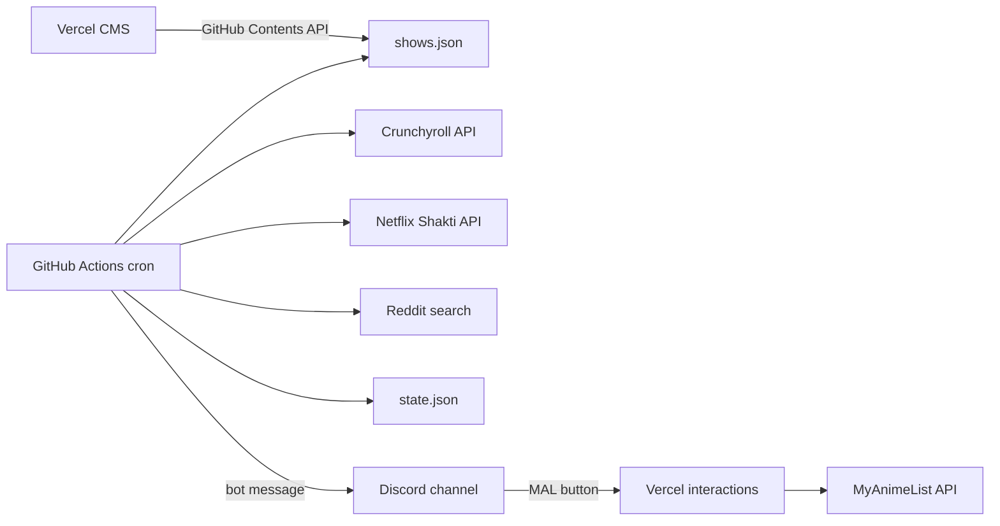

# Anime Episode Checker

Checks **Crunchyroll** or **Netflix** for newly available anime episodes and sends Discord alerts when an episode drops. Manage tracked shows through a small admin CMS on Vercel.

## How it works



1. **GitHub Actions** runs a **5-minute** cron. A cheap gate skips install and provider checks unless a show is in its **drop window** (10 minutes before expected time through until the episode is found).
2. Inside the window, the checker runs about every **5 minutes** and calls `pnpm check`.
3. Each show uses **Crunchyroll or Netflix** (not both).
4. On first run for a show (inside a window), it **baselines** the current episode (no alert).
5. When the expected episode becomes available, it posts to **Discord** (bot message with optional MAL button + r/anime discussion link) and updates [`state.json`](state.json).
6. If an episode is **late** (15+ min past expected), it sends a one-time **still waiting** Discord message.
7. The **Vercel admin** edits `shows.json` in your repo.

## Schedule model

Each show uses a weekly schedule:

| Field | Meaning |
|-------|---------|
| `provider` | `crunchyroll` or `netflix` |
| `mode` | `finite` (season with end) or `ongoing` (no end) |
| `startAt` | When the anchor episode(s) should drop (**stored UTC**, entered as **JST** in CMS) |
| `startEpisode` | Episode number that `startAt` refers to |
| `episodeCount` | Total episodes (finite only) |
| `premiereBatchSize` | Episodes that drop on day 1 (default `1`) |
| `malId` | Optional MyAnimeList anime ID for the Discord MAL button |
| `redditSearchTitle` | Optional slug override for r/anime discussion search |

After the premiere batch, each following episode is expected **7 days** later.

Discord alerts still display times in **Eastern Time (EST/EDT)** even though schedules are entered in **Japan Time (JST)**.

## Setup

### 1. Discord bot

1. Create an application at [Discord Developer Portal](https://discord.com/developers/applications)
2. Add a **Bot** and copy the token → `DISCORD_BOT_TOKEN`
3. Enable **Message Content Intent** if needed for your server setup
4. Invite the bot to your server with permission to send messages in your alert channel
5. Copy the channel ID → `DISCORD_CHANNEL_ID`
6. Copy the application **Public Key** → `DISCORD_PUBLIC_KEY` (Vercel)
7. Under **Interactions**, set the endpoint URL to `https://your-admin.vercel.app/api/discord/interactions`

Optional fallback: a legacy webhook via `DISCORD_WEBHOOK_URL` (no MAL button).

### 2. GitHub Actions secrets

| Secret | Value |
|--------|-------|
| `DISCORD_BOT_TOKEN` | Discord bot token |
| `DISCORD_CHANNEL_ID` | Channel ID for episode alerts |
| `DISCORD_WEBHOOK_URL` | Optional webhook fallback |
| `NETFLIX_COOKIE` | Logged-in `netflix.com` cookie string (for Netflix shows only) |
| `REDDIT_CLIENT_ID` | Reddit script app client ID |
| `REDDIT_CLIENT_SECRET` | Reddit script app secret |
| `REDDIT_USER_AGENT` | e.g. `anime-ep-checker/1.0 by your_reddit_username` |
| `DISCORD_DEPLOY_WEBHOOK_URL` | Webhook for a separate **deploy** Discord channel |

The workflow uses the default `GITHUB_TOKEN` to commit `state.json` updates.

### 2b. Discord deploy notifications

When the **Vercel admin** production deploy succeeds or fails, GitHub receives a `vercel.deployment.success`, `vercel.deployment.error`, or `vercel.deployment.failed` event and [`.github/workflows/notify-deploy.yml`](.github/workflows/notify-deploy.yml) posts to your deploy channel.

1. Create a webhook in your **deploy** Discord channel (not the episode-alerts channel).
2. Add it as GitHub secret `DISCORD_DEPLOY_WEBHOOK_URL`.
3. Ensure the repo is connected to Vercel with the GitHub integration (default for Vercel imports).

Success messages include branch, short commit SHA, commit subject, time (ET), and live URL (`https://{project}.vercel.app` for `main`). Failure messages add the deployment error status and a **Check logs** link to the unique deployment URL. Preview deployments are ignored (`environment == production` only).

### 3. Vercel admin CMS

1. Import this repo in [Vercel](https://vercel.com)
2. Set **Root Directory** to `admin`
3. Set package manager to **pnpm**
4. Add environment variables (see [`admin/.env.example`](admin/.env.example)):

| Variable | Description |
|----------|-------------|
| `ADMIN_PASSWORD` | Password for the admin UI |
| `GITHUB_TOKEN` | PAT with `contents: write` on this repo |
| `GITHUB_REPO` | `your-username/anime-ep-checker` |
| `GITHUB_BRANCH` | `main` (optional) |
| `DISCORD_PUBLIC_KEY` | Discord app public key |
| `MAL_CLIENT_ID` | MAL API client ID |
| `MAL_CLIENT_SECRET` | MAL API client secret |
| `MAL_REDIRECT_URI` | `https://your-admin.vercel.app/api/mal/callback` |
| `MAL_REFRESH_TOKEN` | From one-time OAuth at `/mal` |

### 4. MyAnimeList

1. Create an API client at [myanimelist.net/apiconfig](https://myanimelist.net/apiconfig)
2. Set redirect URI to your admin callback URL
3. Open **/mal** on your deployed admin and connect your account
4. Copy the refresh token into Vercel as `MAL_REFRESH_TOKEN` and redeploy

**Finding a MAL anime ID:** open the anime on MyAnimeList and copy the number from the URL:

`https://myanimelist.net/anime/55888/...` → `55888`

### 5. Netflix cookie

For Netflix-tracked shows, copy your browser cookie string while logged into Netflix (DevTools → Network → any `netflix.com` request → `Cookie` header) into the `NETFLIX_COOKIE` GitHub secret. Refresh it if Shakti requests start failing.

### 6. Local development

```bash
# Root checker (Node 24.11.1)
pnpm install
node --experimental-strip-types src/should-run.ts   # gate only
pnpm check -- --dry-run
pnpm check -- --force        # bypass drop windows (debug)

# Admin CMS
cd admin
pnpm install
pnpm dev
```

Set Discord/Reddit/Netflix env vars in `.env` at the repo root for live checks.

## CMS usage

1. Open your Vercel admin URL and sign in
2. Choose **Crunchyroll** or **Netflix** and paste the series/title URL
3. Optionally set **MAL anime ID** and **Reddit search title**
4. Choose **Finite season** or **Ongoing**
5. Set start date/time (**Japan Time / JST**), start episode number, and premiere batch size
6. **Save changes** — commits to `shows.json` on GitHub

## Files

| File | Purpose |
|------|---------|
| [`shows.json`](shows.json) | Tracked series + weekly schedules |
| [`state.json`](state.json) | Last notified episode per show |
| [`src/check.ts`](src/check.ts) | Main checker CLI |
| [`src/schedule.ts`](src/schedule.ts) | Expected drop times + check windows |
| [`src/crunchyroll.ts`](src/crunchyroll.ts) | Crunchyroll API client |
| [`src/netflix.ts`](src/netflix.ts) | Netflix Shakti client (cookie auth) |
| [`src/reddit.ts`](src/reddit.ts) | r/anime discussion search |
| [`src/discord.ts`](src/discord.ts) | Discord bot/webhook alerts |
| [`src/should-run.ts`](src/should-run.ts) | Cheap gate for Actions |
| [`admin/`](admin/) | Vercel CMS + Discord/MAL interactions |
| [`.github/workflows/check-episodes.yml`](.github/workflows/check-episodes.yml) | Scheduled checker |
| [`.github/workflows/notify-deploy.yml`](.github/workflows/notify-deploy.yml) | Discord notify on Vercel production deploy |

## Notes

- Crunchyroll uses an undocumented internal API (anonymous token). Netflix uses an unofficial Shakti endpoint with your session cookie. Both may break if endpoints change.
- Episode availability uses premium/simulcast timing on CR and Shakti availability on Netflix.
- Schedule times are stored in UTC, entered as **JST** in the CMS, and shown as **Eastern** in Discord.
- Requires **Node 24.11.1** (local and GitHub Actions).
