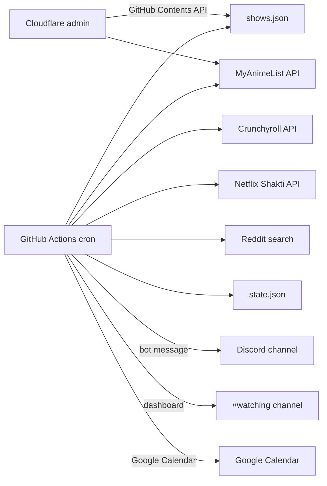

# Anime Episode Checker

Checks **Crunchyroll**, **Netflix**, or **Disney+** for newly available anime episodes and sends Discord alerts when an episode drops. Manage tracked shows through a small admin CMS on Cloudflare Workers.

## How it works


```mermaid
flowchart LR
  Admin[Cloudflare admin] -->|GitHub Contents API| Shows[shows.json]
  Cron[GitHub Actions cron] --> Shows
  Cron --> CR[Crunchyroll API]
  Cron --> NF[Netflix Shakti API]
  Cron --> Reddit[Reddit search]
  Cron --> State[state.json]
  Cron -->|bot message| Discord[Discord channel]
  Cron -->|dashboard| Watching[#watching channel]
  Cron -->|Google Calendar| Calendar[Google Calendar]
  Admin --> MAL[MyAnimeList API]
  Cron --> MAL
```

1. **GitHub Actions** is triggered every **5 minutes** by an external cron (see [Reliable polling](#reliable-polling) below). A cheap gate skips install and provider checks unless a show is in its **drop window** (5 minutes before expected drop through 90 minutes after; then about every 30 minutes if still missing).
2. Inside the window, the checker runs about every **5 minutes** and calls `pnpm check`.
3. Each show uses **Crunchyroll, Netflix, or Disney+** (not multiple).
4. On first run for a show (inside a window), it **baselines** the current episode (no alert).
5. When the expected episode becomes available, it posts to **Discord** (notification-friendly message with MAL cover thumbnail, episode metadata, and Watch / r/anime / MAL link buttons) and updates [`state.json`](state.json).
6. If an episode is **late** (15+ min past expected), it sends a one-time **still waiting** Discord message.
7. Each run also refreshes a **#watching dashboard** (MAL progress + next drops) and syncs **Discord Scheduled Events** for upcoming episodes.
8. The **Cloudflare admin** edits `shows.json` in your repo.

## Schedule model

Each show uses a weekly schedule:

| Field | Meaning |
|-------|---------|
| `provider` | `crunchyroll`, `netflix`, or `disney` |
| `mode` | `finite` (season with end) or `ongoing` (no end) |
| `startAt` | When the anchor episode(s) should drop (**stored UTC**, entered as **JST** in CMS) |
| `startEpisode` | Episode number that `startAt` refers to |
| `episodeCount` | Total episodes (finite only) |
| `premiereBatchSize` | Episodes that drop on day 1 (default `1`) |
| `malId` | Optional MyAnimeList anime ID for the Discord MAL button |
| `redditSearchTitle` | Optional slug override for r/anime discussion search |

After the premiere batch, each following episode is expected **7 days** later.

Discord alerts still display times in **Eastern Time (EST/EDT)** even though schedules are entered in **Japan Time (JST)**.

### Drop-window polling

| Phase | When | Cadence |
|-------|------|---------|
| **Idle** | Before T-5m | Cheap gate only (no provider calls) |
| **Dense** | T-5m → T+90m | Full check about every **5 minutes** (external cron dispatch) |
| **Late** | After T+90m, episode still missing | Full check about every **30 minutes** until found |
| **Done** | Episode found | State advances; show leaves the window until next ep |

GitHub’s built-in `schedule` on `check-episodes.yml` is kept as a backup but is often throttled to ~hourly on free/public repos. Use [Reliable polling](#reliable-polling) for actual 5-minute cadence during drop windows.

### Reliable polling

GitHub Actions alone does not reliably fire every 5 minutes. Use an external cron (e.g. [cron-job.org](https://cron-job.org)) to call `workflow_dispatch` on **Check anime episodes**:

1. Create a **fine-grained PAT** on GitHub with **Actions: Write** (and **Contents: Read** if required) scoped to this repo only.
2. Store the PAT in the cron service only — do not commit it to the repo.
3. Create a job that runs every **5 minutes** and sends:

```http
POST https://api.github.com/repos/<owner>/<repo>/actions/workflows/check-episodes.yml/dispatches
Authorization: Bearer <PAT>
Accept: application/vnd.github+json
Content-Type: application/json

{"ref":"main"}
```

4. Each dispatch runs the **gate** job first (shell only, no marketplace actions). Outside drop windows it exits in seconds and skips the full check. Inside a window, or when the plan-to-watch cadence is due, the **check** job runs `pnpm check`.

If **Check anime episodes** is slow or fails at **Getting action download info** / **Service Unavailable**, that is a GitHub Actions marketplace outage—not the checker. Skip ticks on the gate job do not use marketplace actions and should still finish in seconds; full checks may retry on the next cron tick.
5. To force a full check outside any window, use **Actions → Check anime episodes → Run workflow** and enable **force**.

## Setup

### 1. Discord bot

1. Create an application at [Discord Developer Portal](https://discord.com/developers/applications)
2. Add a **Bot** and copy the token → `DISCORD_BOT_TOKEN`
3. Enable **Message Content Intent** if needed for your server setup
4. Invite the bot with these permissions in your server:
   - Send Messages, Embed Links, Manage Messages (pin dashboard)
5. Create channels and copy IDs:
   - Episode alerts → `DISCORD_CHANNEL_ID`
   - Watching dashboard → `DISCORD_WATCHING_CHANNEL_ID`

Optional fallback: a legacy webhook via `DISCORD_WEBHOOK_URL` (no dashboard).

Discord is **outbound only** (checker posts alerts and updates `#watching`). You do not need an Interactions Endpoint URL or admin Worker Discord secrets.

### 2. GitHub Actions secrets

| Secret | Value |
|--------|-------|
| `DISCORD_BOT_TOKEN` | Discord bot token |
| `DISCORD_CHANNEL_ID` | Channel ID for episode alerts |
| `DISCORD_WATCHING_CHANNEL_ID` | Channel ID for the watching dashboard |
| `DISCORD_WEBHOOK_URL` | Optional webhook fallback |
| `MAL_CLIENT_ID` | MAL API client ID (dashboard progress) |
| `MAL_CLIENT_SECRET` | MAL API client secret |
| `MAL_REFRESH_TOKEN` | MAL OAuth refresh token |
| `NETFLIX_COOKIE` | Logged-in `netflix.com` cookie string (for Netflix shows only) |
| `DISNEY_REFRESH_TOKEN` | Disney+ refresh token (see §6; auto-rotated by the checker) |
| `DISNEY_REGION` | Optional Disney+ region (default `US`) |
| `GH_SECRETS_TOKEN` | Fine-grained PAT with **Secrets: Read and write** on this repo (auto-updates `DISNEY_REFRESH_TOKEN` when Disney rotates it) |
| `GOOGLE_SERVICE_ACCOUNT_JSON` | Full JSON key for a Google service account with Calendar access (see [Google Calendar sync](#google-calendar-sync)) |
| `GOOGLE_CALENDAR_ID` | Calendar ID for your Anime Drops calendar |
| `DISCORD_DEPLOY_WEBHOOK_URL` | Webhook for a separate **deploy** Discord channel |
| `REDDIT_CLIENT_ID` | Reddit “script” app client ID (user post alerts; see [Reddit user post alerts](#reddit-user-post-alerts)) |
| `REDDIT_CLIENT_SECRET` | Reddit app secret |

The workflow uses the default `GITHUB_TOKEN` to commit `state.json` updates.

### 2b. Discord deploy notifications

Pushes to `main` that change `admin/**` run [`.github/workflows/deploy-admin.yml`](.github/workflows/deploy-admin.yml), which deploys the admin Worker and posts success or failure to your deploy Discord channel.

1. Create a webhook in your **deploy** Discord channel (not the episode-alerts channel).
2. Add it as GitHub secret `DISCORD_DEPLOY_WEBHOOK_URL`.
3. Add Cloudflare deploy secrets: `CLOUDFLARE_API_TOKEN` (Workers edit) and `CLOUDFLARE_ACCOUNT_ID`.
4. Optional: `ADMIN_LIVE_URL` (full admin URL) so deploy messages link to the CMS. Defaults to `https://anime-ep-checker.dev/` when unset.

Success messages include branch, short commit SHA, commit subject, time (ET), and the admin URL. Failure messages point at the GitHub Actions logs. Commits that only change checker runtime files (e.g. `state.json` at repo root) do not touch `admin/`, so no admin deploy runs.

### 3. Cloudflare admin CMS

The admin app lives in [`admin/`](admin/) and runs on [Cloudflare Workers](https://developers.cloudflare.com/workers/) via [vinext](https://github.com/cloudflare/vinext) (`vite dev` / `vite build`). Production is served at `https://anime-ep-checker.dev` (custom domain in [`admin/cloudflare.config.ts`](admin/cloudflare.config.ts); `workers.dev` is disabled).

**GitHub Actions (deploy):** set `CLOUDFLARE_API_TOKEN` and `CLOUDFLARE_ACCOUNT_ID` as repository secrets. Pushes to `main` under `admin/**` deploy automatically via [`.github/workflows/deploy-admin.yml`](.github/workflows/deploy-admin.yml).

Do **not** connect this repo in the Cloudflare dashboard (Workers Builds). That integration runs `wrangler deploy` from the repo root without a vinext build and will fail. Deploys are GitHub Actions only.

**Worker secrets (runtime):** after the first successful deploy, from the `admin/` directory set each variable from [`admin/.env.example`](admin/.env.example):

```bash
cd admin
npx wrangler secret put ADMIN_PASSWORD --name anime-ep-checker-admin
npx wrangler secret put GITHUB_TOKEN --name anime-ep-checker-admin
# …repeat for every key in .env.example
```

| Variable | Description |
|----------|-------------|
| `ADMIN_PASSWORD` | Password for the admin UI |
| `GITHUB_TOKEN` | PAT with `contents: write` on this repo |
| `GITHUB_REPO` | `your-username/anime-ep-checker` |
| `GITHUB_BRANCH` | `main` (optional) |
| `MAL_CLIENT_ID` | MAL API client ID |
| `MAL_CLIENT_SECRET` | MAL API client secret |
| `MAL_REDIRECT_URI` | `https://anime-ep-checker.dev/api/mal/callback` |
| `MAL_REFRESH_TOKEN` | From one-time OAuth at `/mal` |

**After the first deploy:**

1. Note your admin URL: `https://anime-ep-checker.dev`
2. Update the MAL API client redirect URI and `MAL_REDIRECT_URI` to `…/api/mal/callback`
3. Shut down the old Vercel project if you migrated from it

**Local dev:** `cd admin && pnpm install && pnpm dev` (vinext on port 3001). Put secrets in `admin/.env` or `admin/.env.local`; they are loaded for every name declared with `bindings.secret()` in [`admin/cloudflare.config.ts`](admin/cloudflare.config.ts). Auth uses `proxy.ts` the same as on Workers.

### 4. MyAnimeList

1. Create an API client at [myanimelist.net/apiconfig](https://myanimelist.net/apiconfig)
2. Set redirect URI to your admin callback URL
3. Open **/mal** on your deployed admin and connect your account
4. Copy the refresh token into Worker secrets as `MAL_REFRESH_TOKEN` (`npx wrangler secret put MAL_REFRESH_TOKEN --name anime-ep-checker-admin`)

**Finding a MAL anime ID:** open the anime on MyAnimeList and copy the number from the URL:

`https://myanimelist.net/anime/55888/...` → `55888`

On the **Watching** page, you can usually leave this blank: the admin searches MAL by title and links the ID when the match is confident. Titles are then kept in sync with MAL.

### 5. Netflix cookie

For Netflix-tracked shows, copy your browser cookie string while logged into Netflix (DevTools → Network → any `netflix.com` request → `Cookie` header) into the `NETFLIX_COOKIE` GitHub secret. Refresh it if pathEvaluator requests start failing (expired session). When the cookie is missing or expired, the checker posts a one-time **Netflix cookie needs refresh** alert to your episode Discord channel via the bot (`DISCORD_BOT_TOKEN` + `DISCORD_CHANNEL_ID`).

### 6. Disney+

Disney+ checks try **anonymous content-edge metadata first** (no secret). For entity-UUID titles like Bleach, set `DISNEY_REFRESH_TOKEN`:

1. Open [disneyplus.com](https://www.disneyplus.com) while logged in (home or a show page — not `login.disney.com`).
2. DevTools → **Console** (main page context, not an iframe) and run:

```js
copy(
  JSON.parse(
    localStorage.getItem('__bam_sdk_access--disney-svod-3d9324fc_prod')
  ).context.refreshToken
)
```

That copies the BAM SDK refresh token to your clipboard. Paste it into the `DISNEY_REFRESH_TOKEN` GitHub secret.

**Fallback:** if the BAM key is missing, try:

```js
copy(
  JSON.parse(localStorage.getItem('DTCI-DISNEYPLUS.WEB-PROD.token'))
    .refresh_token
)
```

Do **not** use `context.token` / `access_token` — those are short-lived JWTs (~4h). The refresh value is a longer encrypted token (`typ: rt+jwt`).

Disney **rotates** the refresh token on every exchange. The checker saves the new value and, when `GH_SECRETS_TOKEN` is set, updates the `DISNEY_REFRESH_TOKEN` secret automatically after each run. You only need to re-copy the token manually if Disney revokes the session (logout, password change) or if `GH_SECRETS_TOKEN` is missing.

**`GH_SECRETS_TOKEN` setup:** create a fine-grained GitHub PAT on this repo with **Secrets: Read and write** and **Metadata: Read**. Add it as the `GH_SECRETS_TOKEN` Actions secret. Without it, rotation still works locally (`disney_refresh_token.txt` in `.gitignore`) but the secret in GitHub Actions will not self-update.

**AniList fallback:** when Disney auth fails or returns no episodes, Disney-tracked shows with a `malId` fall back to [AniList](https://anilist.co) airing schedules (no API key). Alerts still respect your `shows.json` drop time — the fallback never fires before the scheduled Disney+ window. Episode timing in alerts shows as **unknown** (AniList reports JP broadcast, which can be ~1h before the US Disney+ drop).

**GitHub Actions geo-block:** Disney often rejects refresh-token exchange from datacenter IPs (`forbidden-location` on hosted runners). In that case the checker uses the AniList fallback when possible and sends a one-time **Disney+ checks need attention** alert; Crunchyroll and Netflix continue. To verify Disney API data directly, run `pnpm check` (or `pnpm check -- --force`) from home with the same env vars in `.env`.

Optional: set `DISNEY_REGION` (default `US`) if your account is in another region.

### 6. Local development

```bash
# Root checker (Node 24.19.0)
pnpm install
node src/should-run.mjs   # gate only (local; Actions gate fetches JSON via API)
pnpm check -- --dry-run
pnpm check -- --force        # bypass drop windows (debug)

# Admin CMS
cd admin
pnpm install
pnpm dev
```

Set Discord/Netflix/MAL env vars in `.env` at the repo root for live checks.

r/anime discussion links resolve to the AutoLovepon thread permalink when available (via Reddit search RSS), otherwise fall back to an r/anime search URL. No Reddit API secrets required.

### Reddit user post alerts

The checker polls selected Reddit accounts via the **OAuth API** (`oauth.reddit.com`) and posts to the same Discord channel as episode alerts (`DISCORD_CHANNEL_ID` or webhook). GitHub Actions often blocks logged-out RSS; set `REDDIT_CLIENT_ID` and `REDDIT_CLIENT_SECRET` so fetches use app-only OAuth.

1. Open [reddit.com/prefs/apps](https://www.reddit.com/prefs/apps) → **create another app** → type **script** (name e.g. `anime-ep-checker`; redirect URI can be `http://localhost`).
2. Copy the string under the app name → `REDDIT_CLIENT_ID`; copy **secret** → `REDDIT_CLIENT_SECRET`.
3. Add both as GitHub Actions secrets (gate + check jobs).

| Account | Filter |
| --- | --- |
| [u/animecorner](https://www.reddit.com/user/animecorner/) | Titles matching `Top 10 …` (weekly rankings and anticipated lists) |
| [u/Abysswatcherbel](https://www.reddit.com/user/Abysswatcherbel/) | All posts (weekly r/anime karma ranking threads) |

To avoid Reddit rate limits, the Actions gate (`src/should-run.mjs`) only polls a feed during its posting window — the account's usual posting day plus the following day as a grace period (Eastern time: Fridays for u/animecorner, Sundays for u/Abysswatcherbel) — every 15 minutes, and stops for the rest of the window once a post published in it has been seen (`lastPostPublishedAt`). Posts made outside the window are picked up at the next window. The full check only fetches Reddit when the gate asked for it (`REDDIT_FEED_CHECK`) or on `--force`. A full check runs when a feed has no baseline in `state.json`, when a new matching post appears, or when fetches keep failing and the last successful check is stale. The first successful check **baselines** current posts without alerting; only newer posts notify afterward. If a feed cannot be fetched for 6+ hours after the last success (or after its window opened, whichever is later), the checker posts a one-time **Reddit user feed check failing** warning. Seen post IDs are stored under `state.meta.redditUserFeeds`.

### Discord episode alerts (`#anime-alerts`)

Episode alerts use a **classic embed** with a MAL cover thumbnail, plus a top-level message line (e.g. **Yani Neko — Episode 4 is out**) so mobile notifications show readable text. Metadata (season, score, countdown, timing) lives in the embed; Watch / r/anime / MAL are link buttons below. Requires `DISCORD_BOT_TOKEN` + `DISCORD_CHANNEL_ID`; webhook fallback sends a simplified embed with markdown links.

### Discord watching dashboard

The bot maintains a **pinned message per tracked show** in `#watching` using a **classic embed** (MAL cover thumbnail, status, progress, score, next episode, countdown, expected drop) plus a top-level **notification line** (e.g. **One Piece** — MAL 1100 / ? · Next Episode 1160 · Upcoming) so mobile push previews show readable text. Each card also includes **Watch** and **r/anime** link buttons when available. Requires `DISCORD_BOT_TOKEN`, `DISCORD_WATCHING_CHANNEL_ID`, and **MAL secrets on GitHub Actions** (for dashboard sync). Update MAL progress from the admin CMS, not from Discord. If MAL is missing from Actions, the dashboard shows **MAL not configured**; if auth fails, it shows **MAL unavailable**.

### MAL score alerts

On each checker run, the bot compares each show’s MAL **mean score** to the last stored value in `state.json`. A change of **0.05 or more** posts a **score pickup** (green) or **score drop** (red) embed to `#anime-alerts` with cover art and old → new score. Smaller moves are ignored. First fetch baselines the score without alerting.

### Plan-to-watch airing alerts

Once per day (or whenever a tracked show is in its drop window), the checker fetches your MAL **plan to watch** list and sends a **one-shot** Discord alert for each title that is either **currently airing** or **starts within the next 7 days**. Alerted MAL IDs are stored in `state.json` so you only get pinged once per title; removing a show from plan-to-watch and re-adding it later can alert again. The full PTW list is also saved to `state.meta.planToWatch` for the admin **/ptw** page. Requires the same MAL OAuth secrets as the watching dashboard.

### Google Calendar sync

The checker mirrors upcoming drops to a Google Calendar (your **Anime Drops** calendar):

- **Finite seasons:** events for every remaining episode through the season end
- **Ongoing:** only the next upcoming episode (recreated after each drop)
- **30 minutes** long, with popup reminders **10 minutes before** and **at start**
- Title includes episode name when Crunchyroll already lists that episode in the season catalog

**One-time setup:**

1. Google Cloud Console → enable **Google Calendar API**
2. Create a **service account** → Keys → add JSON key
3. Copy `client_email` from the JSON
4. Google Calendar → Anime Drops → **Share with specific people** → add that email with **Make changes to events**
5. Calendar settings → **Integrate calendar** → copy **Calendar ID**
6. Add GitHub secrets `GOOGLE_SERVICE_ACCOUNT_JSON` (full JSON) and `GOOGLE_CALENDAR_ID`

When an episode drops, its calendar event is removed. Use **Delay +1 week** in the admin (below) to shift a delayed show and rebuild Discord + Calendar events.

## CMS usage

1. Open your Cloudflare admin URL and sign in
2. Use the profile menu to switch between **Watching** (`/`) and **Plan to watch** (`/ptw`)
3. On **Watching**, choose **Crunchyroll**, **Netflix**, or **Disney+** and paste the series/title URL
4. **MAL anime ID** is optional: if left blank, the admin tries to auto-match from the show title on load; once linked, the ID is hidden under **More options** (still editable)
5. Tracked show **titles** sync from MAL when a `malId` is known (on page load via `POST /api/shows/sync-mal`)
6. Choose **Finite season** or **Ongoing**
7. Set start date/time (**Japan Time / JST**), start episode number, and premiere batch size
8. **Delay +1 week** (saved shows only) shifts `startAt` by 7 days and clears Discord/Calendar event state so the checker rebuilds events on the next forced run
9. **Save changes** — commits to `shows.json` on GitHub

For **Delay +1 week**, the admin `GITHUB_TOKEN` PAT should include **Actions: Write** so a forced check workflow starts automatically. Otherwise run **Actions → Check anime episodes → Run workflow** with **force** after delaying.

### Plan to watch page (`/ptw`)

Shows your MAL plan-to-watch list from `state.meta.planToWatch`, grouped into **Airing**, **Not yet aired**, and **Aired**. Use **Refresh** to fetch the latest list from MAL and save a new snapshot to `state.json`. The checker also refreshes this snapshot during its plan-to-watch alert pass.

## Files

| File | Purpose |
|------|---------|
| [`shows.json`](shows.json) | Tracked series + weekly schedules |
| [`state.json`](state.json) | Last notified episode per show |
| [`src/check.ts`](src/check.ts) | Main checker CLI |
| [`src/schedule.ts`](src/schedule.ts) | Expected drop times + check windows |
| [`src/crunchyroll.ts`](src/crunchyroll.ts) | Crunchyroll API client |
| [`src/netflix.ts`](src/netflix.ts) | Netflix pathEvaluator client (cookie auth) |
| [`src/disney.ts`](src/disney.ts) | Disney+ explore API client (refresh token auth) |
| [`src/anilist.ts`](src/anilist.ts) | AniList airing schedule fallback for Disney+ shows |
| [`src/reddit.ts`](src/reddit.ts) | r/anime discussion lookup (AutoLovepon RSS + search fallback) |
| [`src/reddit-feeds.ts`](src/reddit-feeds.ts) | Reddit user submission feeds + Discord alerts |
| [`src/discord.ts`](src/discord.ts) | Discord bot/webhook alerts + score alerts |
| [`src/discord-format.ts`](src/discord-format.ts) | Embed formatting helpers |
| [`src/discord-dashboard.ts`](src/discord-dashboard.ts) | #watching dashboard sync |
| [`src/google-calendar.ts`](src/google-calendar.ts) | Google Calendar episode sync |
| [`src/dashboard.ts`](src/dashboard.ts) | Dashboard status + embed builder |
| [`src/mal.ts`](src/mal.ts) | MAL read-only progress (checker) |
| [`src/mal-score.ts`](src/mal-score.ts) | MAL score spike/tank detection |
| [`src/plan-to-watch.ts`](src/plan-to-watch.ts) | MAL plan-to-watch airing alerts |
| [`src/should-run.mjs`](src/should-run.mjs) | Cheap gate for Actions (no marketplace actions on skip path) |
| [`admin/`](admin/) | Cloudflare CMS (vinext) |
| [`.github/workflows/check-episodes.yml`](.github/workflows/check-episodes.yml) | Gate + full episode check (`schedule`, `workflow_dispatch`, or external cron) |
| [`.github/workflows/deploy-admin.yml`](.github/workflows/deploy-admin.yml) | Deploy admin Worker + Discord deploy notify |

## Notes

- Crunchyroll uses an undocumented internal API (anonymous token). Netflix uses an unofficial Shakti endpoint with your session cookie. Disney+ uses private bamgrid explore APIs with your session cookie. All may break if endpoints change.
- Episode availability uses premium/simulcast timing on CR, Shakti availability on Netflix, and release metadata on Disney+.
- Schedule times are stored in UTC, entered as **JST** in the CMS, and shown as **Eastern** in Discord.
- Requires **Node 24.19.0** (local and GitHub Actions).
